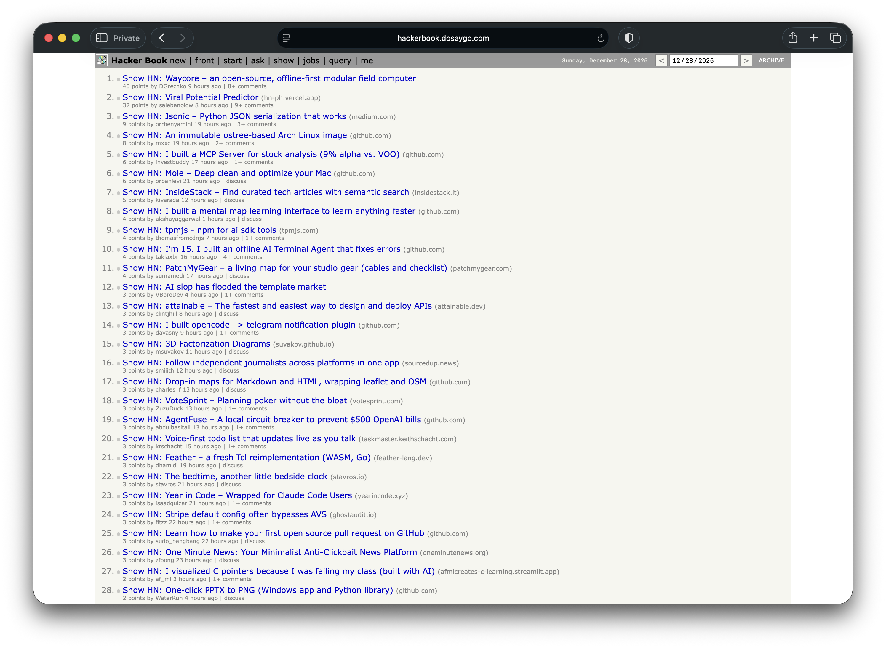
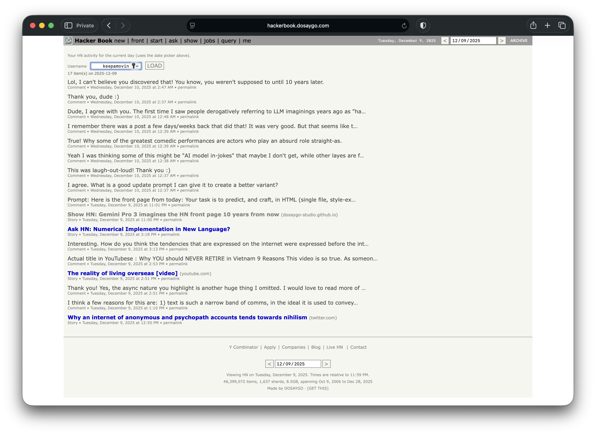

# Hacker Book - The unkillable, offline Hacker News archive

Community, all the HN belong to you. This repo packages 20 years of Hacker News into a **static** archive you can run entirely in your browser. The site is just files: HTML, JSON, and gzipped SQLite shards. No server app required.

- Demo: https://hackerbook.dosaygo.com
- Landing / download: https://dosaygo-studio.github.io/HackerBook/
- Code: https://github.com/DOSAYGO-STUDIO/HackerBook

> [!NOTE]
> This project is an archive and a toolkit: run it locally, mirror it, or build your own daily snapshots.

## Table of contents
- [What this is](#what-this-is)
- [How it works](#how-it-works)
- [Screenshots](#screenshots)
- [Quick start](#quick-start)
- [Repository layout](#repository-layout)
- [Pipeline overview](#pipeline-overview)
- [Restarting safely](#restarting-safely)
- [Shards and content hashing](#shards-and-content-hashing)
- [User stats shards](#user-stats-shards)
- [Index builders](#index-builders)
- [Deploy checklist](#deploy-checklist)
- [Contribute analysis](#contribute-analysis)
- [FAQ](#faq)
- [Notes](#notes)

## What this is
A fully static Hacker News archive that runs **entirely in your browser** using SQLite compiled to WebAssembly. The browser fetches only the shard files it needs for the page you are viewing, so the initial load is tiny and navigation stays fast.

> Community, all the HN belong to you. This is an archive of Hacker News that fits in your browser. The whole dataset. So they'll never die. Ever. It's the unkillable static archive of HN in your hands.

Inspired by HN Made of Primes, this is the "year-end gift" to the community: keep a durable, offline-friendly HN archive forever.

> [!TIP]
> The "organizing idea": **ship data like a static website**. Everything is a file. Everything is cacheable. Everything is yours.

## How it works
- **SQLite WASM in the browser** runs queries client-side.
- **The archive is sharded** into gzipped SQLite files so the browser can fetch only what it needs.
- **Manifests and indexes** describe where shards live and what they contain.
- **Content hashing** bakes a short SHA-256 into each shard filename for perfect cache correctness.

> [!IMPORTANT]
> The shards are immutable by filename. If content changes, the hash changes, and caches refresh automatically.

## Screenshots
**Query view**

**Me view**

## Quick start
Always run `npm install` once in the repo root.

**Archivist workflow (the short version)**  
BigQuery -> ETL -> `npx serve docs`

**Build + prep everything**
1) `./toool/s/predeploy-checks.sh [--use-staging] [--restart-etl] [--from-shards] [--hash-only]`
2) Serve `docs/` locally: `npx serve docs` or `python3 -m http.server 8000 --directory docs`

**Download the published site (no ETL)**
1) `node toool/download-site.mjs [--base URL] [--out DIR] [--no-shards]`
2) Serve the downloaded folder.

> [!TIP]
> Use `AUTO_RUN=1` for unattended pipeline runs.

## Repository layout
- `docs/`: the static site (HTML, JS, CSS, manifests, indexes, shards)
- `docs/static-shards/`: gzipped item/comment shards
- `docs/static-user-stats-shards/`: user stats shards
- `data/`: raw dumps + staging DB
- `download_hn.sh`: BigQuery export helper
- `etl-hn.js`: main shard builder + post-pass
- `build-archive-index.js`: archive index builder
- `toool/s/`: scripts for predeploy, index builds, downloads

## Pipeline overview
1) **Raw data**: BigQuery exports in `data/raw/*.json.gz` (or `toool/data/raw/`).
2) **Staging (optional)**: imports into `data/static-staging-hn.sqlite`.
3) **Shard build**: write `.sqlite` shards in `docs/static-shards/`.
4) **Post-pass**: VACUUM, gzip, hash rename, manifest rewrite.
5) **Indexes**: archive, cross-shard, user stats.
6) **Deploy**: publish `docs/`.

`./toool/s/predeploy-checks.sh` runs the full pipeline with prompts.

Flags:
- `--use-staging` use `data/static-staging-hn.sqlite` instead of raw downloads.
- `--restart-etl` resume post-pass/gzip from existing shards and/or `.prepass`.
- `--from-shards` skip ETL; normalize shard hashes and rebuild from existing shards.
- `--hash-only` with `--from-shards`, only normalize shard hashes (skip post-pass).
- `AUTO_RUN=1` auto-advance prompts.

> [!WARNING]
> `--hash-only` assumes you already have gzipped shards. It will not gzip `.sqlite` files.

## Restarting safely
This pipeline is designed to tolerate interrupts.

- Kill only after a shard completes (`[shard N] ... file ...MB`).
- If killed mid-gzip, restart with: `./toool/s/predeploy-checks.sh --restart-etl`.
- The post-pass detects partial output and resumes from the last good shard.

## Shards and content hashing
**Items/comments shards** live in `docs/static-shards/`.

- Filenames are hashed: `shard_<sid>_<hash>.sqlite.gz`.
- `<hash>` is 12 hex chars (SHA-256 truncated).
- Hashing happens after VACUUM + gzip, so the hash represents the final bytes.

Why this matters:
- Cache correctness is automatic. If the shard changes, the URL changes.
- Old shards can be cached forever (`immutable`), while new snapshots fetch cleanly.

## User stats shards
User stats are separate shards optimized for usernames and monthly activity.

- Location: `docs/static-user-stats-shards/`
- Manifest: `docs/static-user-stats-manifest.json(.gz)`
- Tables: `users`, `user_domains`, `user_months`
- Built by: `node ./toool/s/build-user-stats.mjs --gzip --target-mb 15`

The app switches to these shards for the `?view=me` view and when you select "User stats shards" in query mode.

## Index builders
- Archive index: `node ./build-archive-index.js`
- Cross-shard index: `node ./toool/s/build-cross-shard-index.mjs --binary`
- User stats: `node ./toool/s/build-user-stats.mjs --gzip --target-mb 15`

## Deploy checklist
- `static-manifest.json(.gz)` updated and points to hashed shards.
- `archive-index.json(.gz)` updated.
- `cross-shard-index.bin(.gz)` updated.
- `static-user-stats-manifest.json(.gz)` updated.
- Cache-bust string bumped in `docs/index.html` and `docs/static.html`.

## Contribute analysis
Have charts or analyses you want to feature? Email a link and a short caption to `hey@browserbox.io`. Bonus points for fresh takes and bold visualizations. 📊

## FAQ
**Is this really offline?**
Yes. Once the shards you need are cached, browsing is offline. You can also download the whole site and run it locally. ✨

**Why shards instead of HTTP Range requests?**
Shards are friendlier to static hosting and cache behavior, and make it easier to reason about data integrity.

**How big is it?**
The full archive is ~9GB gzipped (~22GB uncompressed), split across ~1.6k shards.

## Notes
- Works best on modern browsers (Chrome, Firefox, Safari) with `DecompressionStream`; falls back to pako gzip when needed.
- Mobile layout is optimized for tap navigation and small screens.
- Viewer and ETL code are MIT-licensed.
- HN content remains property of Y Combinator and the respective authors.
